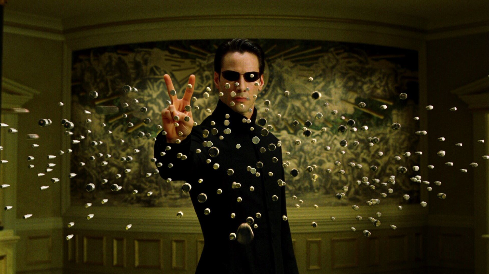

# Detail Stitch — ComfyUI custom nodes

Two nodes for precise crop and paste workflows with metadata in ComfyUI. The nodes are useful to make precise edits for two main reasons: using all the pixels in a limited area (so more detial and coherence) and leaving all the rest of the image untouched by the edit. Even though edit models can make edits on a specific part of the image they ruin and create artifacts on the rest during the sampling process, these nodes avoid that.

## Nodes

### Crop with Metadata
Crops an image (or uses a mask bounding box) and saves position metadata for later recomposition. Supports pixel or percent padding.

### Paste with Metadata
Pastes a processed image back into the original at the exact position stored in the metadata. Supports exclude mask.

## Example Workflow

The included workflow (`workflow/crop with metadata_example.json`) demonstrates an example of a detail stitch pipeline using:

- **SAM 3.1** (built-in ComfyUI) for segmentation
- **FLUX.2-klein-9B** for sampling — other models work too
- The following custom nodes:
  - [comfyui-easy-use](https://github.com/yolain/ComfyUI-Easy-Use)
  - [comfyui-kjnodes](https://github.com/kijai/ComfyUI-KJNodes)
  - [comfyui_essentials](https://github.com/cubiq/ComfyUI_essentials)
  - [comfyui-image-compare](https://github.com/Pfaeff/comfyui-image-compare)



## Installation

Install via ComfyUI Manager or clone manually:

```
cd ComfyUI/custom_nodes
git clone https://github.com/mancusog/comfyui-detail-stitch.git
```